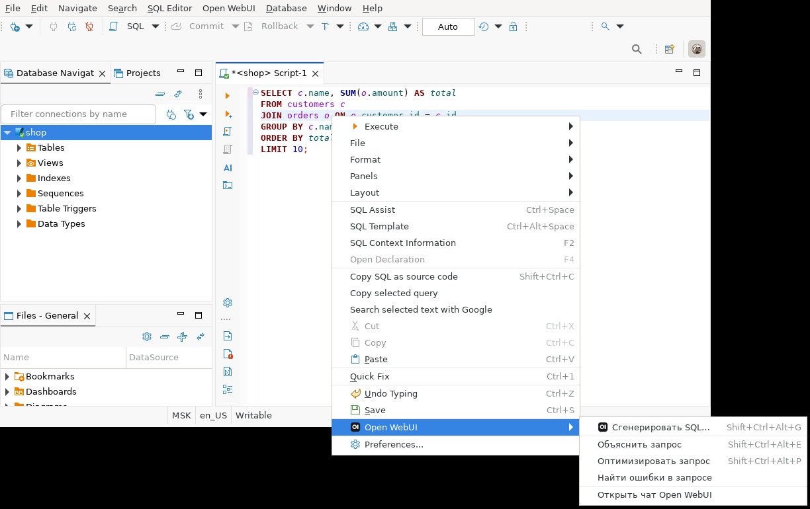
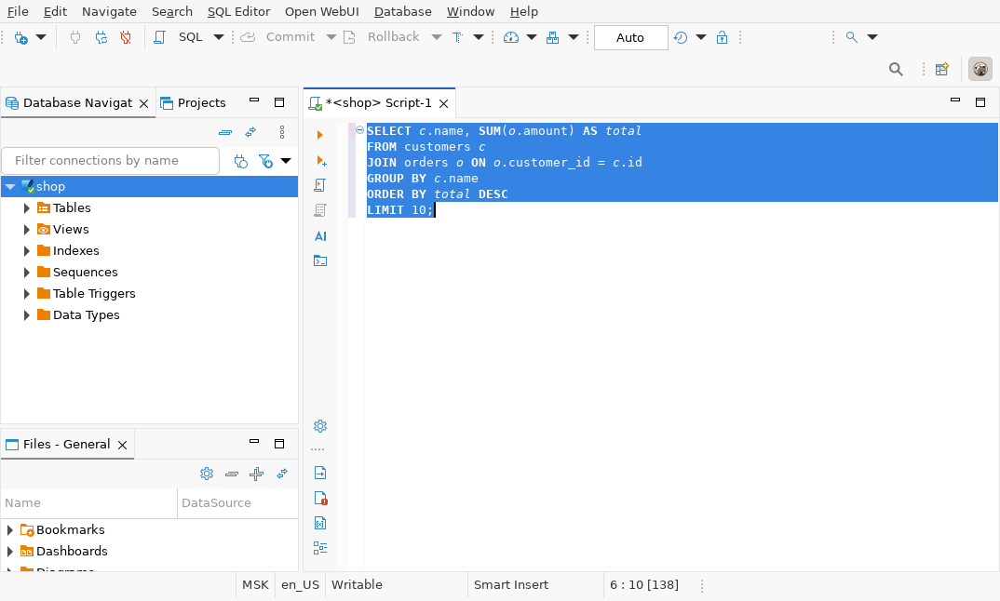
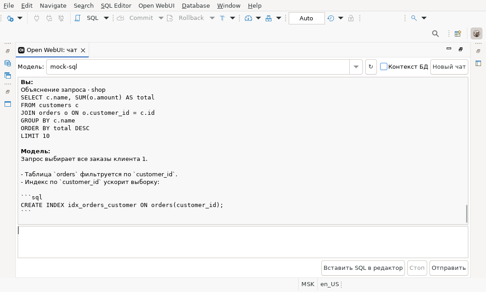
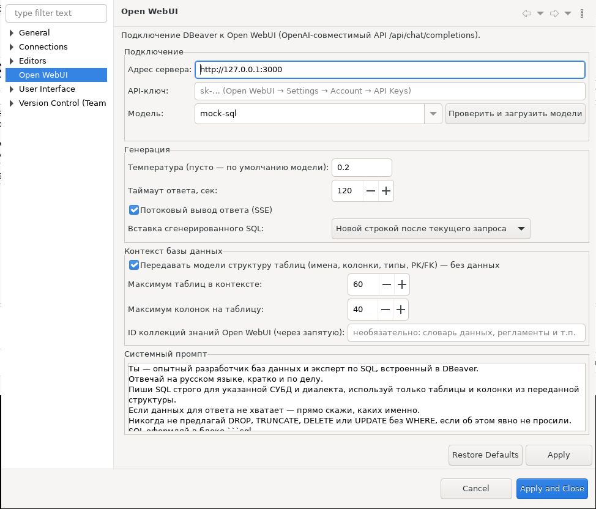
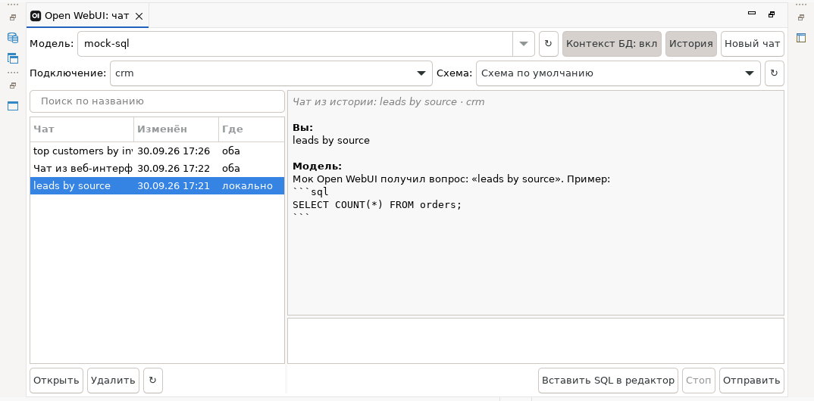

# Open WebUI для DBeaver

[](../../actions/workflows/build.yml)

## Изменения

- **1.0.2** — в панели чата выбор подключения и схемы (по умолчанию «Авто» — подключение активного
  SQL-редактора); выбор запоминается. История чатов: панель «История» с поиском, открытием, продолжением
  и удалением диалогов. Локально история хранится всегда, в Open WebUI — по настройке
  «Также сохранять чаты в Open WebUI» (по умолчанию выключена). Чаты, созданные в веб-интерфейсе,
  открываются и продолжаются в DBeaver, и наоборот.
- **1.0.1** — контекст подключения передаётся, даже если соединение не было открыто: плагин подключается
  сам. Контекст в чате обновляется на каждое сообщение, есть запасной источник — выделение в навигаторе.
  Флажок «Контекст БД» заменён переключателем с явным состоянием. Пояснение о переданном контексте
  в чате и строке состояния. Если схема по умолчанию пуста, обходится всё подключение.

Плагин подключает DBeaver к [Open WebUI](https://docs.openwebui.com/) через его OpenAI-совместимый API
и добавляет в SQL-редактор работу с LLM:

| Команда | Где | Что делает |
|---|---|---|
| **Сгенерировать SQL…** `Ctrl+Shift+Alt+G` | контекстное меню редактора, меню *Open WebUI* | Описание задачи на естественном языке → SQL, вставленный в редактор. Учитывает структуру таблиц активного подключения. Может доработать выделенный запрос. |
| **Объяснить запрос** `Ctrl+Shift+Alt+E` | то же | Разбор выделенного запроса или запроса под курсором. Ответ — в чат-панели. |
| **Оптимизировать запрос** `Ctrl+Shift+Alt+P` | то же | Узкие места, переписанный запрос, индексы. |
| **Найти ошибки в запросе** | то же | Синтаксис диалекта, несуществующие колонки, логические ловушки, опасные UPDATE/DELETE. |
| **Чат Open WebUI** | *Window → Show View* или меню *Open WebUI* | Свободный диалог: выбор модели, подключения и схемы, продолжение любой команды уточняющими вопросами, кнопка «Вставить SQL в редактор». |
| **История чатов** | кнопка «История» в панели чата | Список сохранённых диалогов с поиском; открыть, продолжить, удалить. Локально — всегда, в Open WebUI — по настройке. |

Проверено на **DBeaver CE 25.3.0** (Linux x86_64, Java 21): компиляция против библиотек DBeaver, установка
из архива update site через p2, генерация SQL на SQLite-базе, объяснение запроса в чате, загрузка списка
моделей, сохранение API-ключа, обработка недоступного сервера. Сервер Open WebUI в проверке был имитирован.

## Установка

DBeaver 25.x **не подхватывает плагины из папки `dropins`** (реконсилер p2 там не запускается),
поэтому ставьте через update site:

1. Скачайте `io.dbtools.openwebui-site-<версия>.zip` со страницы
   [Releases](../../releases/latest) (или соберите сами, см. ниже).
2. DBeaver → **Help → Install New Software… → Add… → Archive…** → выберите zip.
3. Отметьте *Open WebUI integration*, **Next → Finish**, подтвердите установку неподписанного
   содержимого, перезапустите DBeaver.

Для массовой установки без GUI (например, из скрипта развёртывания):

```bash
cd "$DBEAVER_HOME"
jre/bin/java -jar plugins/org.eclipse.equinox.launcher_*.jar -nosplash \
  -application org.eclipse.equinox.p2.director \
  -repository "jar:file:/path/io.dbtools.openwebui-site-<версия>.zip!/" \
  -installIU io.dbtools.openwebui.feature.feature.group
```

Обновление с предыдущей версии в консоли — в одной команде снять старую и поставить новую
(через Help → Install New Software DBeaver делает это сам):

```bash
... -uninstallIU io.dbtools.openwebui.feature.feature.group -installIU io.dbtools.openwebui.feature.feature.group
```

## Настройка

**Window → Preferences → Open WebUI** (или меню *Open WebUI → Настройки…*):

- **Адрес сервера** — например `http://owui.company.local:3000` (без `/api`).
- **API-ключ** — Open WebUI → *Settings → Account → API Keys*. Администратор должен разрешить API-ключи
  (*Admin Panel → Settings → General → Enable API Key*). Ключ хранится в Eclipse Secure Storage;
  на Linux без системного хранилища ключей Eclipse один раз попросит задать мастер-пароль.
  Запасной вариант — переменная окружения `OPENWEBUI_API_KEY`.
- **Модель** — кнопка «Проверить и загрузить модели» подтягивает список из `GET /api/models`.
- **Температура**, **таймаут**, **потоковый вывод (SSE)**, **режим вставки SQL**
  (новой строкой после текущего запроса / в позицию курсора / заменить выделение).
- **Контекст БД** — передавать ли модели структуру таблиц; лимиты таблиц и колонок.
- **ID коллекций знаний** — коллекции Open WebUI (RAG), которые подмешиваются к каждому запросу:
  словарь данных, описание бизнес-сущностей, регламенты. Передаются как `files: [{type: "collection", id}]`.
- **Системный промпт** — редактируемый; по умолчанию запрещает модели предлагать DROP/TRUNCATE и
  UPDATE/DELETE без WHERE.

## Что уходит в модель

Только **метаданные**: СУБД и версия, диалект, схема по умолчанию, имена таблиц и представлений,
колонки с типами, PK, FK, NOT NULL. **Данные таблиц не читаются и не передаются.**
Если таблиц больше лимита, в приоритете те, чьи имена встречаются в задаче или запросе.
Передачу структуры можно отключить в настройках или кнопкой «Контекст БД: вкл/выкл» в чате.

Если соединение ещё не открыто (DBeaver подключается лениво — после перезапуска, простоя или
Disconnect), плагин сам подключится перед запросом. Что именно ушло модели, видно сразу: в чате —
строка «Контекст: «shop» (SQLite 3.46.1, shop), таблиц: 4», при генерации SQL — в строке состояния.
Если контекст передать не удалось, там же написана причина. В чате контекст берётся из активного
SQL-редактора, а если его нет — из подключения, выделенного в навигаторе.
Системные схемы (`information_schema`, `pg_catalog`, `sys`, `mysql`, `performance_schema`) пропускаются.

## История чатов

- **Локально** каждый диалог сохраняется после каждого ответа в
  `<рабочее пространство DBeaver>/.metadata/.plugins/io.dbtools.openwebui/chats/*.json`.
- **В Open WebUI** — если включить *Параметры → Open WebUI → «Также сохранять чаты в Open WebUI»*. Используется
  API `/api/v1/chats`: диалог появляется в веб-интерфейсе, структура БД кладётся в системный промпт чата,
  поэтому разговор можно продолжить в браузере. В панели «История» тогда видны и чаты, созданные в вебе
  (колонка «Где»: «локально», «Open WebUI» или «оба»).
- При удалении чата, который есть в обоих местах, плагин спрашивает, удалять ли его и в Open WebUI.

## Сборка

### Maven + Tycho (основной вариант)

Нужны JDK 21, Maven 3.9+ и установленный DBeaver — он служит целевой платформой.

```bash
export DBEAVER_HOME=/opt/dbeaver          # каталог с папкой plugins
mvn clean verify
# → releng/io.dbtools.openwebui.site/target/io.dbtools.openwebui.site-1.0.0-SNAPSHOT.zip
```

Альтернатива — зависимости из p2-репозиториев Eclipse и DBeaver: `mvn -Pp2 clean verify`.

> Tycho-конфигурация подготовлена, но в среде разработки не прогонялась (не было доступа к Maven Central).
> Сборка скриптом `build-offline.sh` проверена полностью.

### Без Maven (закрытый контур)

Если Maven Central недоступен, скрипт соберёт плагин и update site только средствами JDK и самого DBeaver:

```bash
DBEAVER_HOME=/opt/dbeaver ./scripts/build-offline.sh
# → dist/io.dbtools.openwebui_<версия>.jar и dist/io.dbtools.openwebui-site-<версия>.zip
```

### Eclipse PDE

*Import → Existing Projects* → `bundles/io.dbtools.openwebui`; целевая платформа —
`releng/dbeaver-local.target` (или *Preferences → Plug-in Development → Target Platform → Add → Directory*
с путём к DBeaver). Запуск: *Run As → Eclipse Application* с продуктом
`org.jkiss.dbeaver.ui.app.standalone.product`.

### CI

GitHub Actions на каждый push собирает плагин против DBeaver CE (версия задана в
`.github/workflows/build.yml`), прогоняет тесты и проверяет установку update site через p2.
По тегу `v*` архивы публикуются в Releases.

### Тесты

```bash
DBEAVER_HOME=/opt/dbeaver ./scripts/run-tests.sh
```

49 проверок против встроенного фейкового Open WebUI, Eclipse не нужен:

- 23 — HTTP-клиент: список моделей, авторизация, обычный и потоковый ответ, служебные SSE-события,
  ошибки 401/404, недоступный сервер, промпты, извлечение SQL из ответа (включая блоки `<think>`);
- 26 — история: API чатов Open WebUI (создание, обновление без лишних веток, чтение текущей ветки,
  удаление) и локальное хранилище.

## Структура

```
bundles/io.dbtools.openwebui/
  plugin.xml                     команды, меню, горячие клавиши, панель, страница настроек
  src/io/dbtools/openwebui/
    api/        OpenWebUIClient  HTTP-клиент: /api/models, /api/chat/completions (JSON и SSE)
    ai/         PromptFactory    промпты для генерации, объяснения, оптимизации, проверки
                ResponseParser   извлечение SQL из ответа
    context/    SqlEditorContext снимок SQL-редактора: подключение, диалект, выделение/текущий запрос
                SchemaContextBuilder  структура БД → компактное описание для промпта
                EditorInserter   вставка SQL в документ
    handlers/   обработчики команд
    prefs/      настройки, Secure Storage
    ui/         ChatView (панель чата), GenerateSqlDialog
bundles/io.dbtools.openwebui.tests/   смоук-тесты без Eclipse
features/io.dbtools.openwebui.feature/
releng/io.dbtools.openwebui.site/     p2 update site (Tycho)
releng/dbeaver-local.target           целевая платформа = локальный DBeaver
scripts/                              офлайн-сборка и тесты
```

## Ограничения текущей версии

- Отмена потокового ответа срабатывает между фрагментами; если сервер долго молчит, запрос завершится по таймауту.
- История чата не сохраняется между перезапусками DBeaver.
- Соединение по HTTPS использует доверенные сертификаты JVM DBeaver. Для корпоративного CA добавьте его в
  `$DBEAVER_HOME/jre/lib/security/cacerts` или укажите `-Djavax.net.ssl.trustStore` в `dbeaver.ini`.
- Идентификатор бандла `io.dbtools.openwebui` — замените на корпоративный перед публикацией
  (MANIFEST.MF, plugin.xml, feature.xml, pom.xml, пакеты Java).

## Скриншоты

| | |
|---|---|
|  |  |
|  |  |
|  | |

## Лицензия

[MIT](LICENSE).
