# Open WebUI для AI-ассистента DBeaver

[](../../actions/workflows/build.yml)

Плагин добавляет во встроенный AI-ассистент DBeaver Community Edition новый движок
**«Open WebUI (OpenAI-compatible)»**. Движок появляется в *Окно → Параметры → AI → Движки* рядом с OpenAI
и GitHub Copilot. Через него работают штатные функции ассистента: AI-чат, генерация SQL, команда `@ai`
в редакторе и вызов функций для чтения метаданных БД.

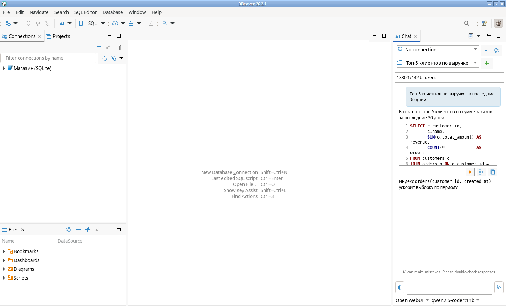

## Изменения

- **2.2.0**
  - **Ограничение передаваемых метаданных** в настройках движка: скрыть сведения о подключении,
    снимок БД полностью / только имена / не передавать, запрет DDL и текста SQL-редактора, лимит объёма.
  - **«Мои промпты» удобнее:** щелчок по значку показывает список (раньше открывал настройки), промпты
    есть в контекстном меню SQL-редактора, подробная инструкция в README.
- **2.1.0**
  - **DBeaver 25.2.4–25.2.5.** Отдельный совместимый бандл. На 25.2 версия 2.0.x падала с
    «Can't load class OpenWebUIProperties»: AI API в 25.2 другой. p2 сам ставит подходящий вариант.
  - **Обновление поверх старых версий.** Если при установке отметить категорию *Open WebUI integration*
    целиком, плагин 1.x (`io.dbtools.openwebui`) и версии 2.0.x обновляются на месте, без ручного удаления.
  - **Кнопка ▶ под SQL в AI-чате** работает и без выбранного в чате подключения. В DBeaver она тогда
    молча ничего не делала, теперь подключение берётся из SQL-редактора, навигатора или диалога выбора.
  - **Мои промпты.** Сохранённые промпты в *AI → Prompts → My prompts*, вызов из панели AI Chat;
    `${selection}` подставляет выделенный SQL.
- **2.0.2** — документация со скриншотами и раздел «Использование»; скриншоты снимаются автоматически
  в CI на DBeaver CE 26.2.1. Код плагина не менялся.
- **2.0.1** — релиз публикуется сборкой сразу с архивами update site (в 2.0.0 их нет).
- **2.0.0** — новый плагин `dbeaver.openwebui.ai`: движок для встроенного AI-ассистента DBeaver 26.2+
  вместо собственных панелей и команд. Плагин 1.x (`io.dbtools.openwebui`) удалён из репозитория;
  его исходники остались под тегом [v1.0.2](../../tree/v1.0.2).

## Зачем отдельный движок

Встроенный движок OpenAI в DBeaver 26.x обращается к **Responses API** (`POST <base>/responses`).
Open WebUI отдаёт только **Chat Completions API**:

| Что | Open WebUI | Встроенный OpenAI-движок DBeaver |
|---|---|---|
| Список моделей | `GET /api/models` | `GET <base>/models` |
| Чат | `POST /api/chat/completions` | `POST <base>/responses` |

Поэтому подставить URL Open WebUI во встроенный движок не получится. Плагин реализует отдельный
движок поверх Chat Completions. Он подходит и для других совместимых серверов: LiteLLM, vLLM,
LM Studio, Ollama (`/v1`), корпоративных шлюзов.

## Возможности

- Загрузка списка моделей Open WebUI (модели Ollama, OpenAI-подключения, пайплайны, кастомные модели).
- Размер контекста берётся из карточки модели (`num_ctx`, `context_length`), иначе 32 768 (можно изменить).
- Потоковые ответы (SSE) с подсчётом токенов (`stream_options.include_usage`).
- Вызов функций (tools): ассистент сам читает список схем, таблиц и DDL. Учтены особенности Ollama:
  `finish_reason: "stop"` вместо `tool_calls`, аргументы объектом, отсутствие `index`.
- Скрытие рассуждений `<think>…</think>` (DeepSeek-R1, Qwen3, QwQ), в том числе когда тег разорван между чанками.
- Повтор запроса без `temperature` для моделей, которые его не принимают (o-серия, gpt-5 через OpenAI-подключение).
- API-ключ хранится в защищённом хранилище DBeaver, а не в JSON профиля.
- Дополнительные HTTP-заголовки (Cloudflare Access, корпоративный прокси).
- Понятные ошибки: `{"detail": ...}` от Open WebUI, 401/404, HTML-страница вместо JSON при неверном URL.
- Кнопка ▶ под SQL в AI-чате выполняет запрос, даже если в чате не выбрано подключение.
- «Мои промпты»: сохранённые промпты с подстановкой выделенного SQL.
- Ограничение метаданных, которые уходят модели: сведения о подключении, снимок БД, DDL, текст редактора.
- Интерфейс на русском и английском.

## Требования

| DBeaver CE | Бандл | Что работает |
|---|---|---|
| **26.2 и новее** | `dbeaver.openwebui.ai` | AI Chat, генерация SQL, `@ai`, вызов функций, кнопка ▶, «Мои промпты» |
| **25.2.4–25.2.5** | `dbeaver.openwebui.ai.compat25` | AI-подсказки и `@ai` в SQL-редакторе, вызов функций (панели AI Chat в CE 25.2 нет) |
| 25.3.x – 26.1.x, 25.2.3 и старше | — | не поддерживаются: в этих версиях другой AI API |

Оба бандла лежат в одном архиве update site, p2 ставит тот, что подходит установленному DBeaver.
AI API DBeaver меняется почти в каждой версии, поэтому версии, на которых собран и проверен релиз,
указаны в его описании.

Нужен Open WebUI с включёнными API-ключами или любой сервер OpenAI Chat Completions.

## Установка

DBeaver **не подхватывает плагины из папки `dropins`** (реконсилер p2 там не запускается),
поэтому ставьте через update site:

1. Скачайте `dbeaver-openwebui-ai-site-<версия>.zip` со страницы
   [Releases](../../releases/latest) (или соберите сами, см. ниже).
2. DBeaver → **Help → Install New Software… → Add… → Archive…** → выберите zip.
3. Отметьте категорию **Open WebUI integration целиком** (обе фичи в ней), **Next → Finish**,
   подтвердите установку неподписанного содержимого, перезапустите DBeaver.

**Обновление.** Тот же порядок: архив новой версии, категория целиком. Мастер сообщит, что установленные
компоненты будут обновлены, и сам заменит старую версию:

- **2.x:** фича `dbeaver.openwebui.ai.feature` обновляется по совпадающему id;
- **1.x (`io.dbtools.openwebui`):** в категории есть переходная фича с id старого плагина. Мастер обновляет
  через неё, старый бандл с отдельной панелью чата удаляется, ставится движок.

Обновление с 2.0.2 и 1.0.2 проверяется в CI тем же механизмом p2 (`InstallOperation`), что и мастер установки.

Для массовой установки без GUI (например, из скрипта развёртывания):

```bash
cd "$DBEAVER_HOME"
jre/bin/java -jar plugins/org.eclipse.equinox.launcher_*.jar -nosplash \
  -application org.eclipse.equinox.p2.director \
  -repository "jar:file:/path/dbeaver-openwebui-ai-site-<версия>.zip!/" \
  -installIU dbeaver.openwebui.ai.feature.feature.group,io.dbtools.openwebui.feature.feature.group
```

Если в DBeaver нет папки `jre` (так у Linux-архива 25.2.4), вместо `jre/bin/java` укажите Java 21 из системы.
Director, в отличие от мастера, сам не заменяет старую версию. При обновлении из консоли в той же команде
снимите старую: `-uninstallIU dbeaver.openwebui.ai.feature.feature.group` (для 2.x) или
`-uninstallIU io.dbtools.openwebui.feature.feature.group` (для 1.x).

**Удаление:** *Installation Details → Installed Software → Open WebUI engine for DBeaver AI assistant → Uninstall*.

## Настройка

1. В Open WebUI включите API-ключи: *Admin Panel → Settings → General → Enable API Keys*.
   Затем создайте ключ: *Settings → Account → API Keys*.
2. В DBeaver откройте настройки AI: шестерёнка в панели *AI Chat* (или *Окно → Параметры → AI*) →
   *Model configurations* → **+** (*Create new profile*) → движок **Open WebUI (OpenAI-compatible)**.

   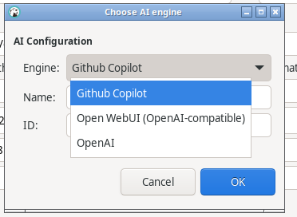

3. Заполните:
   - **Базовый URL** — `http://host:3000/api`. Если указать только `http://host:3000`, `/api` добавится сам.
     Для vLLM/LiteLLM/LM Studio — `http://host:port/v1`.
   - **API-ключ** — `sk-…` из Open WebUI (или JWT). Оставьте пустым, если аутентификация отключена.
   - **Модель** — кнопка обновления загрузит список с сервера.
   - **Размер контекста** — подставляется из модели. Для Ollama проверьте значение: по умолчанию там часто 2048–8192.
4. *Test Connection* → OK, затем *Apply and Close*.

   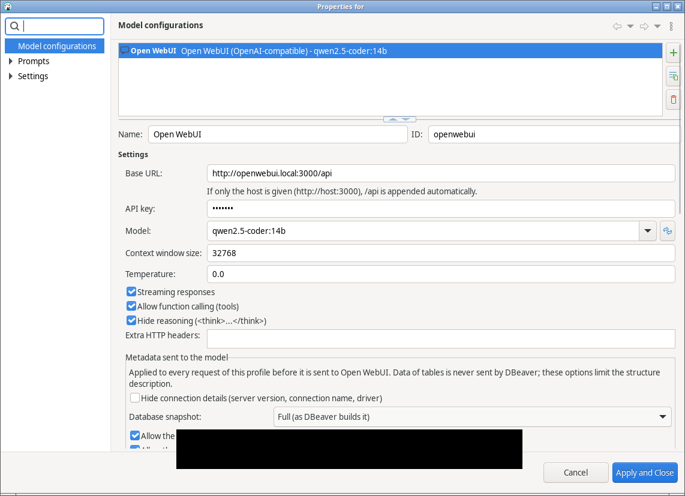

   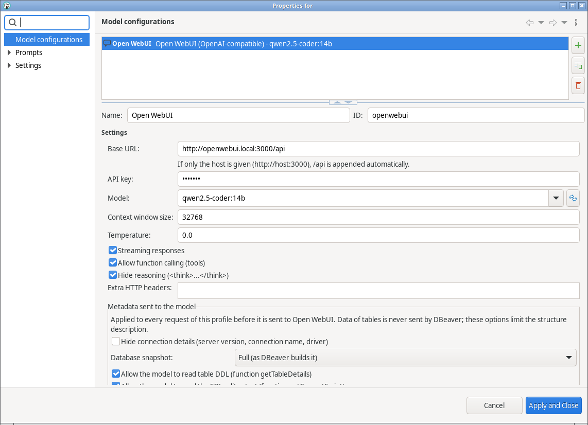

**DBeaver 25.2.4–25.2.5.** Там профилей нет: *Window → Preferences → AI* → *Engine:* **Open WebUI
(OpenAI-compatible)**. Поля те же, затем *Test Connection* и *Apply and Close*.

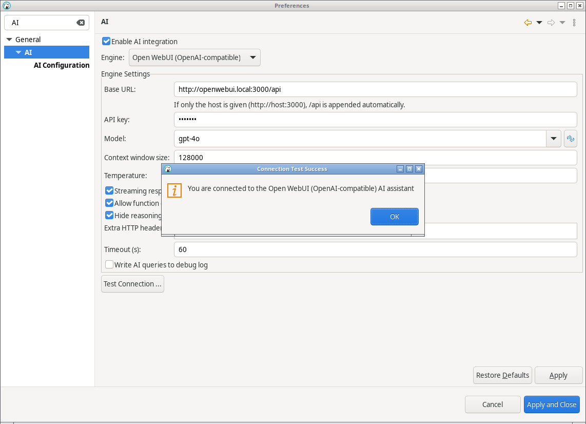

## Использование

Откройте панель *AI Chat* (*Window → AI Chat*), внизу выберите профиль **Open WebUI** и модель.
Список моделей загружается с сервера, *Refresh models* обновляет его.

<p>
  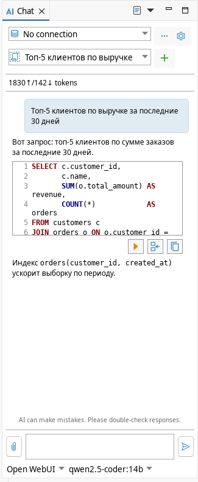
  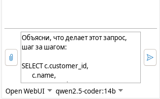
</p>

Ответы приходят потоком. SQL из ответа можно выполнить, вставить в редактор или скопировать кнопками
под блоком кода. Если в чате выбрано подключение к БД, модель сама запрашивает список схем, таблиц и DDL
через функции DBeaver (нужна модель с поддержкой tool calling).

### Кнопка ▶: выполнить SQL из ответа

Штатно DBeaver выполняет запрос только через подключение, выбранное в чате. При «No connection» кнопка
молча ничего не делает, а в списке подключений чата видны только уже открытые подключения. Плагин
дополняет кнопку: если подключения в чате нет, он по порядку пробует:

1. подключение активного SQL-редактора;
2. подключение, выделенное в навигаторе;
3. единственное подключение проекта;
4. если ничего не подошло, предлагает выбрать подключение в диалоге.

Затем подключение открывается, и запрос выполняется в SQL-консоли.

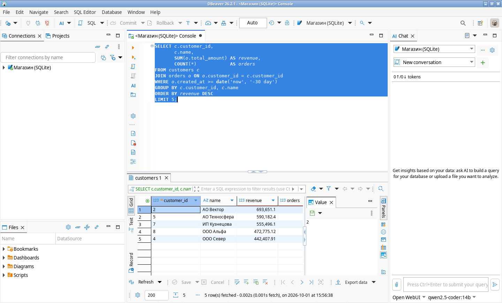

### Мои промпты

«Мои промпты» — заготовки запросов к модели, которые вы часто повторяете: «объясни запрос»,
«найди ошибки», «перепиши под PostgreSQL» и т.п. Работают только в DBeaver 26.2+: в CE 25.2 нет панели
AI Chat. Это не то же самое, что штатная страница DBeaver *AI → Prompts → SQL query generation*: там
задаются дополнительные инструкции, которые DBeaver молча добавляет к каждому запросу.

**Как пользоваться.** Пример: объяснить запрос из редактора.

1. Откройте SQL-редактор и выделите запрос (или просто поставьте курсор внутрь него).
2. Щёлкните правой кнопкой в редакторе → **My prompts** → **Объяснить запрос**.
   То же самое есть на панели *AI Chat*: значок **My prompts** справа от вкладки *Chat* (щелчок по значку
   или по стрелке рядом). Ещё один вариант — меню кнопки *AI* на главной панели инструментов.
3. Откроется панель *AI Chat*, а текст промпта с подставленным запросом уйдёт модели. Если у промпта
   снят флажок «отправлять сразу», текст только вставится в поле ввода: допишите его и нажмите *Ctrl+Enter*.

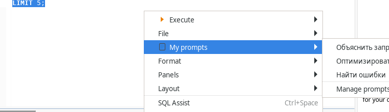

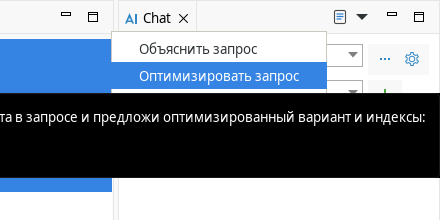

При первой отправке по подключению DBeaver спрашивает «Transfer information to AI vendor?». Если ответить
*No*, запрос не уйдёт, и покажется, что промпт не сработал. Ответьте *Yes* или настройте передачу
метаданных (см. ниже).

**Свои промпты** добавляются и правятся в *AI → Prompts → My prompts*. Туда можно попасть через шестерёнку
панели *AI Chat* или *Window → Preferences*, а также через пункт *Manage prompts…* в конце списка промптов.

- **Название** — так промпт выглядит в меню.
- **Промпт** — текст для модели. `${selection}` заменяется выделенным в SQL-редакторе текстом, а если
  выделения нет, запросом под курсором. Без `${selection}` текст уходит как есть.
- **Отправлять сразу** — сразу отправить или вставить в поле ввода для правки. Промпты без флажка
  помечены в меню многоточием.
- Кнопки **Add**, **Delete** и стрелки порядка, затем *Apply and Close*. *Restore Defaults* возвращает три
  примера.

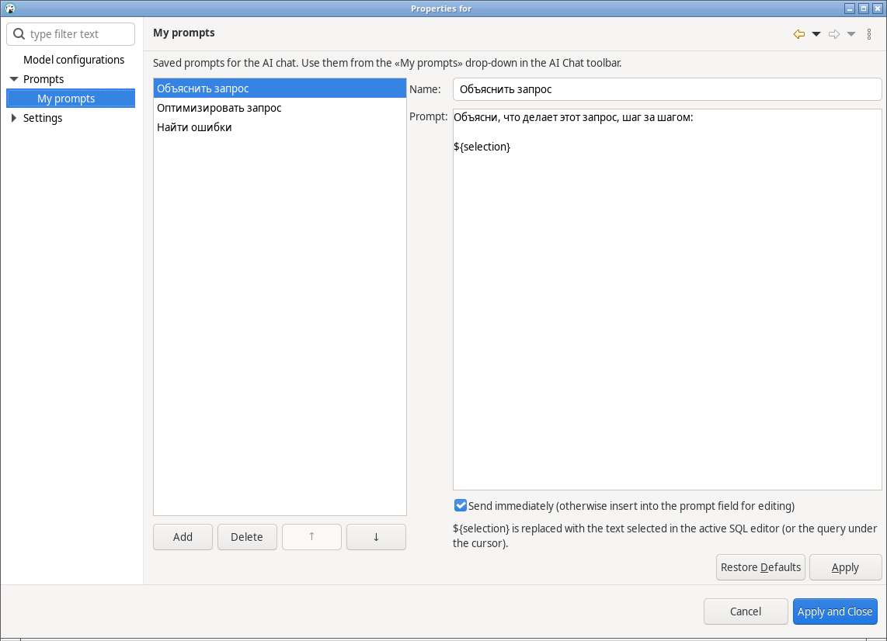

Промпты хранятся в файле `openwebui-prompts.json` в папке `.metadata/.config` рабочего пространства
DBeaver, рядом с `ai-configuration.json`. Файл можно скопировать на другой компьютер.

### Какие метаданные получает модель и как это ограничить

DBeaver не передаёт модели данные из таблиц. Передаётся описание структуры:

| Что | Где | Содержимое |
|---|---|---|
| Контекст подключения | системный промпт, раздел *Context* | диалект SQL, версия сервера, **имя подключения DBeaver**, драйвер, схема по умолчанию, дата |
| Снимок БД | системный промпт, раздел *Database snapshot* | списки каталогов и схем; при выключенном вызове функций — **DDL всех таблиц** выбранной области |
| Результаты функций | ответы на вызовы модели | списки схем и таблиц, **DDL таблиц** (`getTableDetails`), **текст SQL-редактора** (`getCurrentScript`) |

В настройках профиля Open WebUI (и в *Window → Preferences → AI* для 25.2) есть группа
**«Передача метаданных модели»**. Она применяется к каждому запросу перед отправкой:

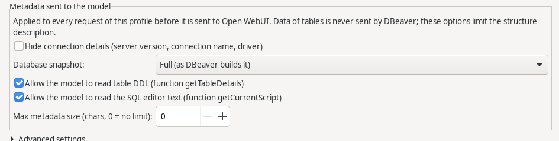

- **Скрывать сведения о подключении** — убирает версию сервера, имя подключения и драйвер. Диалект и схема
  по умолчанию остаются: без них модель пишет SQL не для той СУБД.
- **Снимок БД** — *полный*, *только имена каталогов и схем* (без DDL) или *не передавать*.
- **Разрешить модели читать DDL таблиц** — если выключить, функция `getTableDetails` не предлагается модели,
  и она видит только имена таблиц и колонок, которые назовёте вы сами.
- **Разрешить модели читать текст SQL-редактора** — если выключить, функция `getCurrentScript` не предлагается.
  В редакторе бывают литералы с реальными данными.
- **Макс. объём метаданных** — ограничивает снимок БД и каждый результат функции (символов, 0 — без ограничения).

Самый строгий вариант: скрыть сведения о подключении, снимок «только имена», DDL и текст редактора запрещены.
Модель знает только диалект и названия схем. Чтобы она написала запрос, назовите таблицы и колонки в вопросе.
Дополнительно можно сузить область прямо в чате (кнопка *…* рядом с подключением) или снять «Разрешить вызов
функций».

Скриншоты сняты автоматически workflow *docs* на DBeaver CE 26.2.1 и 25.2.4 с mock-сервером Open WebUI.

Для SQL лучше подходят модели с нативным tool calling (Qwen2.5/3, Llama 3.1+, GPT-4o и т.п.). Если модель
не умеет tools, снимите «Разрешить вызов функций»: ассистент будет работать по контексту, без чтения метаданных.

## Устранение проблем

| Симптом | Причина / решение |
|---|---|
| Движка нет в списке после установки | Версия DBeaver ниже 26.2, или DBeaver не перезапущен |
| `Server returned an HTML page instead of JSON` | URL без `/api`, либо указан адрес веб-интерфейса за другим путём |
| `HTTP 401: Not authenticated` | Неверный ключ или API-ключи не включены администратором |
| `HTTP 404/405` | Неверный путь. Для Open WebUI — `/api`, для vLLM — `/v1` |
| Ответ приходит целиком в конце | Прокси буферизует SSE: отключите буферизацию (`proxy_buffering off` в nginx) или снимите «Потоковые ответы» |
| Таймаут на первом запросе к Ollama | Модель загружается в память: увеличьте таймаут в «Дополнительно» |
| Ассистент не видит таблицы | Модель не поддерживает tools или снят флажок вызова функций |
| Отладка | «Дополнительно» → логирование запросов, лог: `~/.local/share/DBeaverData/workspace6/.metadata/dbeaver-debug.log` (API-ключ в лог не пишется) |

## Сборка

Нужны JDK 21+ и две установки DBeaver CE: 26.2+ (против неё собирается основной бандл, её p2 публикует
update site) и 25.2.4/25.2.5 (против неё собирается совместимый бандл). Maven и интернет не нужны.

```bash
DBEAVER_HOME=/opt/dbeaver-26.2 DBEAVER25_HOME=/opt/dbeaver-25.2.4 ./scripts/build-offline.sh
# → dist/dbeaver-openwebui-ai-site-<версия>.zip и jar обоих бандлов
```

Без `DBEAVER25_HOME` нужно явно указать `SKIP_COMPAT25=1`: тогда в сайт попадёт только вариант для 26.2+.
На macOS `DBEAVER_HOME=/Applications/DBeaver.app/Contents/Eclipse`, на Windows — Git Bash или WSL.

### Тесты

```bash
DBEAVER_HOME=/opt/dbeaver ./scripts/run-tests.sh       # или GSON_JAR=/path/gson.jar
```

72 проверки против mock-сервера Open WebUI, DBeaver запускать не нужно: 54 для основного бандла
(заглушки API в `tests/api-stubs`, сигнатуры из DBeaver 26.2) и 18 для совместимого (`tests/api-stubs-25`,
из DBeaver 25.2.4). Проверяются:
нормализация URL, модели и `num_ctx`, 401 и HTML вместо JSON, поток с разорванным `<think>`, usage,
два tool call с аргументами по кускам и `finish_reason: stop`, аргументы объектом, синхронный режим,
эмуляция потока, повтор без temperature, ошибка `detail`, конвертация истории (в том числе вызовы
от другого движка без id), заголовки, отсутствие секретов в JSON профиля. Для 25.2 дополнительно:
локальные сообщения не уходят модели, один вызов функции на ответ, подсчёт токенов. В обоих — фильтр
метаданных: скрытие подключения, режимы снимка, лимит, отбор функций.

### CI

`build` на каждый push и pull request:

1. скачивает последний релиз DBeaver CE и 25.2.4 (`scripts/get-dbeaver.sh`);
2. прогоняет тесты обоих бандлов;
3. собирает их против настоящих jar каждой версии;
4. проверяет установку через `InstallOperation` (как мастер *Install New Software*): на каждой версии должен
   встать свой бандл;
5. проверяет обновление с 2.0.2 (архив из релиза) и с 1.0.2 (собирается из тега `v1.0.2`): старая версия
   должна удалиться (`scripts/upgrade-test.sh`, `tests/p2test`).

Выпуск версии: поднимите версию в `MANIFEST.MF` обоих бандлов и в `feature.xml` всех фич, затем
*Actions → build → Run workflow* с `release_tag` = `v<версия>`. Релиз создаётся, только если все проверки
прошли. В репозитории включены неизменяемые релизы, поэтому не создавайте релиз вручную через
*Draft a new release*: он выйдет без архивов.

`docs` (запуск вручную) снимает скриншоты в DBeaver 26.2.x и 25.2.4 на виртуальном дисплее с mock Open WebUI.
Флажок *publish* обновляет картинки в `docs/screenshots`.

## Структура

```
bundles/dbeaver.openwebui.ai/            DBeaver 26.2+
  src/dbeaver/openwebui/model/           движок: клиент Chat Completions, SSE, tool calls, <think>
  src/dbeaver/openwebui/ui/              панель настроек, ChatExecuteFix (кнопка ▶)
  src/dbeaver/openwebui/prompts/         «Мои промпты»: хранилище, страница настроек, меню
bundles/dbeaver.openwebui.ai.compat25/   DBeaver 25.2.4–25.2.5: тот же движок под старый AI API
features/
  dbeaver.openwebui.ai.feature           зонтичная фича (ставит подходящий вариант)
  dbeaver.openwebui.ai.dbeaver26.feature вариант для 26.2+
  dbeaver.openwebui.ai.dbeaver25.feature вариант для 25.2.4–25.2.5
  io.dbtools.openwebui.feature           переходная фича: обновление с 1.x
releng/site/category.xml                 категория update site
scripts/                                 сборка, тесты, проверка установки/обновления, скриншоты
tests/                                   заглушки API DBeaver 26.2 и 25.2.4, mock Open WebUI, тесты, p2test
docs/demo, docs/demo25                   сценарии скриншотов
```

### Точки интеграции с DBeaver

- расширение `com.dbeaver.ai.engine` → `completionEngine` (класс движка и класс свойств);
- расширение `org.jkiss.dbeaver.ui.propertyConfigurator` → панель настроек (поиск по точному имени класса движка);
- `BaseCompletionEngine`, `AbstractHttpAIClient` (HTTP/1.1 — важно для uvicorn, на котором работает Open WebUI),
  `AIEngineResponseConsumer`, `AbstractAIEngineConfigurator`, `ModelSelectorField`, `ContextWindowSizeField`.

## Ограничения

- С настоящим сервером Open WebUI плагин пока не проверялся: в CI вместо него mock-сервер. В workflow *docs*
  в живых DBeaver проверены:
  - **26.2.1:** настройки, загрузка моделей, проверка подключения, потоковый ответ в чате, выполнение SQL
    из ответа, «Мои промпты»;
  - **25.2.4:** выбор движка, загрузка моделей, проверка подключения.
- Кнопки под SQL-блоком в CI нажать нельзя: во встроенном браузере WebKit на раннерах не выполняется
  JavaScript. Логика кнопки ▶ проверяется тестовым хуком (`-Ddbeaver.openwebui.selftest`), который передаёт
  SQL в тот же обработчик. Сам обработчик подменяет JS-функцию чата `executeInEditor`. Если в будущей версии
  DBeaver эта функция изменится, кнопка вернётся к штатному поведению.
- «Мои промпты» и кнопка ▶ есть только в варианте для DBeaver 26.2+.
- Update site не подписан: при установке DBeaver попросит подтвердить установку неподписанного содержимого.

## Лицензия

MIT, см. [LICENSE](LICENSE). Файлы в `tests/api-stubs`, скопированные из исходников DBeaver,
распространяются под Apache License 2.0 (заголовки сохранены).
